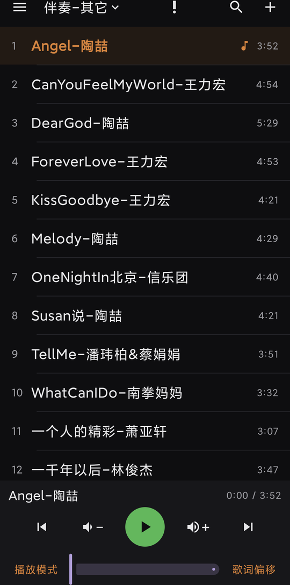
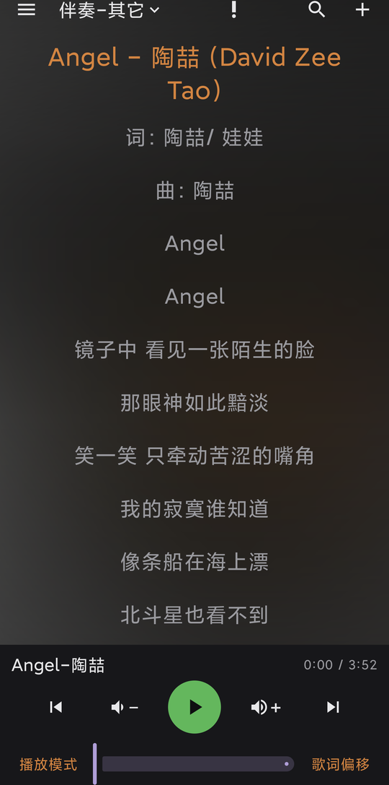
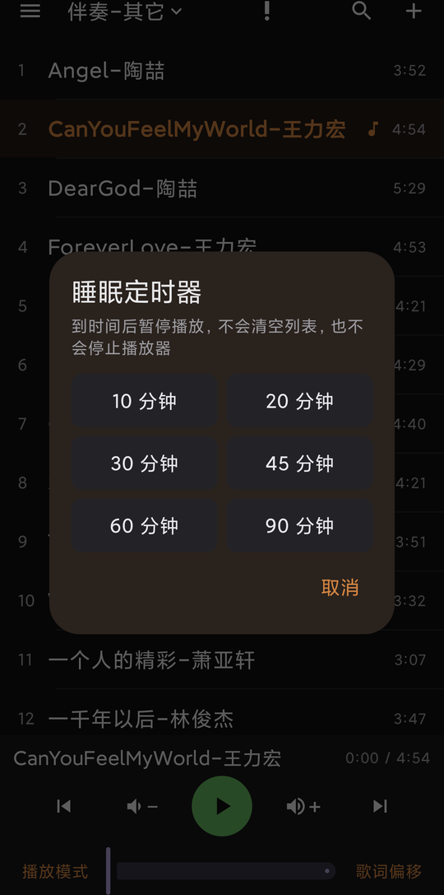
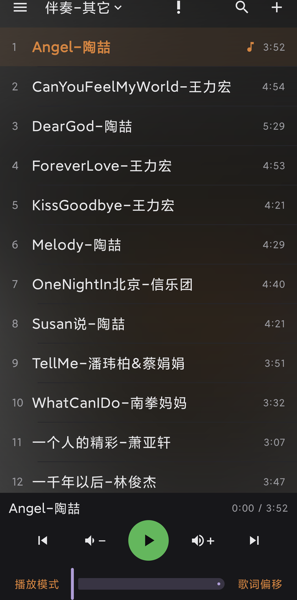

# A-Music

**纯粹的安卓本地音乐播放器，无广告无弹窗。**

只播放你自己手机里的歌，不采集任何数据、没有账号也没有广告。

| 歌曲列表 | 歌词页 | 睡眠定时器 |
|---|---|---|
|  |  |  |

## 它能做什么

**放歌**

- 从手机目录里挑歌导入，想导多少导多少；同一首歌不用怕重复导，它会提醒你
- 后台播放：退出应用、锁屏，歌都继续放；通知栏和锁屏上都能控制
- 五种播放模式：顺序循环 / 倒序循环 / 随机循环 / 单曲循环 / 列表循环（这个列表放完自动换下一个列表接着放）
- **睡眠定时器**：睡前设 10~90 分钟，到点自动暂停，不怕听着歌睡着
- 歌太多找不到？全局搜索一输入歌名就出来

**看歌词**

- 自动配歌词：只要歌曲文件夹里有**同名的 `.lrc` 文件**，或者歌本身**内嵌了歌词**，就直接显示，不用你动手
- 歌词自动滚动、自动高亮到当前句；字太小？7 档字号随便调
- 唱得对不上拍？**歌词偏移**整体提前 / 延后，改完直接写回歌词文件
- 手机里没有这首歌的歌词？点**在线搜词**找一找，预览后保存（**只有点这个按钮才会联网**，
  平时完全离线；网上偶尔搜不到想要的歌词，属于正常现象）
- 保存时繁体歌词自动转成简体

**好看**

- 界面背景跟着歌走：有专辑封面就把它模糊成一层淡淡的色调（文字始终清晰可读），没有封面就换一套配色，每首歌都不同
- 底部播放栏是一块圆角毛玻璃卡片

| 有封面的歌：封面模糊成淡淡的背景色 |
|---|
|  |

## 怎么用

1. 到 [Releases](../../releases) 下载 `A-Music-1.0.apk`，装到手机上（需要允许"安装未知来源应用"）
2. 第一次打开按提示授权：**音乐和音频**（读歌）、**所有文件访问**（读歌词文件）、**通知**（锁屏控制）
3. 点右上角 **＋** → **为当前列表导入歌曲** → 去文件夹里勾选你要的歌（可以整个文件夹一起选）
4. 点一首歌就开始放了；左右滑动可以在"歌曲列表"和"歌词"两页之间切换

**不支持各种歌单**：音乐平台的歌单、`.m3u` / `.pls` 这类歌单文件都不能导入。
歌只能从你手机里的音频文件导入，导入之后可以在应用里自己建列表、往里加歌。

## 常问问题

**会动我的歌吗？**
不会。导入只是"记下文件在哪"，你的音频文件一个字节都不会被改；删除列表、移出歌曲也只是动应用里的记录。
唯一的例外：你主动用"歌词偏移"或保存歌词时，它才会改写**那首歌的歌词**（`.lrc` 文件或内嵌歌词）。

**要联网吗？**
平时完全离线。唯一联网的是你主动点「在线搜词」去找歌词的时候。

**收费吗？有广告吗？**
没有。没有账号、没有广告、没有任何统计。

**能装在我的手机上吗？**
Android 7.0 及以上都可以。因为它需要一个特殊权限来读歌词文件，所以不能上架 Google Play，只能这样直接安装安装包。

## 免责声明

本项目是一个本地播放器，不提供、不下载、不搜索任何在线音乐内容，也不与任何音乐服务存在关联。
播放的内容来自用户自己的设备，请确保你拥有相应文件的合法使用权。

## 许可

[MIT](LICENSE)
